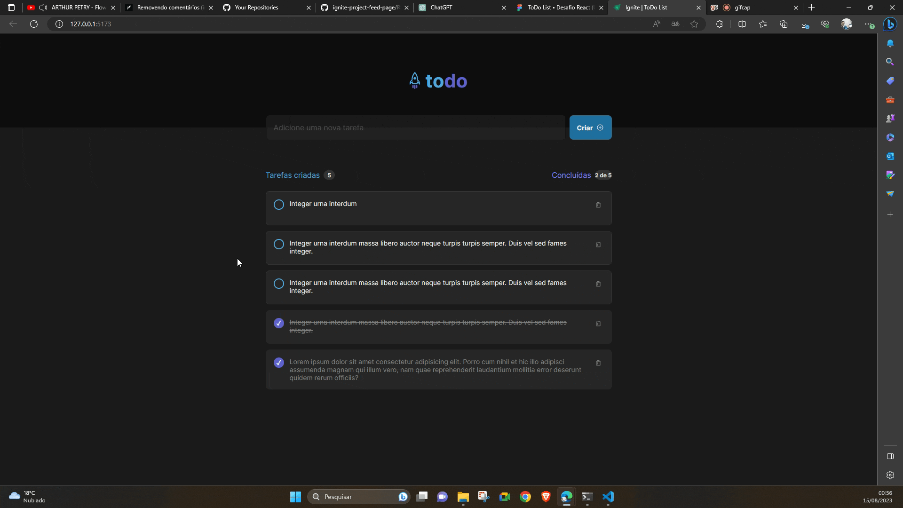

# [Ignite ToDo List](https://ignite-project-todolist-jdir.vercel.app/) 🚀



This is a project created using the concepts learned in [Rocketseat's](https://www.rocketseat.com.br/) classes in the Ignite program for a To Do List.

## Design

This Front-end project was developed based on the design proposed in [Figma](https://www.figma.com/file/1ArJmfKbNqM0Z5zrjwFGCd/ToDo-List-%E2%80%A2-Desafio-React-(Copy)?type=design&node-id=101%3A96&mode=design&t=XSHWfaJ2thJ4E1tE-1).


## Technologies

This project was developed using Vite + ReactJS, Typescript.

The project dependencies were:

```json
"dependencies": {
   "@phosphor-icons/react": "^2.0.10",
   "@types/uuid": "^9.0.2",
   "classnames": "^2.3.2",
   "react": "^18.2.0",
   "react-dom": "^18.2.0",
   "uuid": "^9.0.0"
},
"devDependencies": {
   "@types/react": "^18.2.15",
   "@types/react-dom": "^18.2.7",
   "@typescript-eslint/eslint-plugin": "^6.0.0",
   "@typescript-eslint/parser": "^6.0.0",
   "@vitejs/plugin-react": "^4.0.3",
   "eslint": "^8.45.0",
   "eslint-plugin-react-hooks": "^4.6.0",
   "eslint-plugin-react-refresh": "^0.4.3",
   "typescript": "^5.0.2",
   "vite": "^4.4.5"
}
```

## Run Project

Run the installation of dependencies with:

```shell
npm i
```

Run the exe project using the command:

```shell
npm run dev
```

😝 Enjoy!!

## What I Learned with This Project?

### Too many props

With this project I learned that there were components that I had to use props a lot. I had difficulty communicating between elements and in a future class I saw that this can be improved using contexts in React.

```ts
...
<CreateTask
   newTaskContent={newTaskContent}
   handleNewTaskChange={handleNewTaskChange}
   handleCreateNewTask={handleCreateNewTask}
   handleNewTaskInvalid={handleNewTaskInvalid}
/>
<ListTask
   tasks={tasks} 
   onDeleteTask={onDeleteTask}
   onChangeChecked={onChangeChecked}
/>
...
```

### References and Value in Javascript

During development I learned that I have to copy the list, because if I point a variable directly to another I would have problems because I am passing the list pointer.

```ts
function onChangeChecked(taskToChange:Task){
   const taskIndex = tasks.findIndex(task => task.id === taskToChange.id)
   let newTasks = task // <---- Problema Here
   newTasks[taskIndex].isComplete = !newTasks[taskIndex].isComplete
   setTasks(newTasks)
}
```

The correct way is to create a new list.

```ts
function onChangeChecked(taskToChange:Task){
   const taskIndex = tasks.findIndex(task => task.id === taskToChange.id)
   let newTasks = [...tasks] // <---- Correct
   newTasks[taskIndex].isComplete = !newTasks[taskIndex].isComplete
   setTasks(newTasks)
}
```

### Design Limite Screen

I learned about how to make the design more responsive using `@media`. With it I can change classes in CSS based on a specific size.

```css
@media (max-width: 768px) {
   .createTask input[type=text]{
      width: 100%;
   }
   .createTask{
      display: block;
   }
   .createTask button[type=submit]{
      margin-top: 0.5rem;
      width: 100%;
   }
}
```

## Acknowledgment

Thanks to [Rocketseat](https://www.rocketseat.com.br/) for the content and initiatives it provides.🚀
